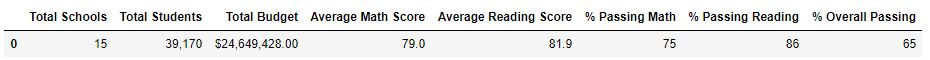
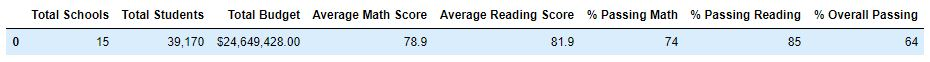
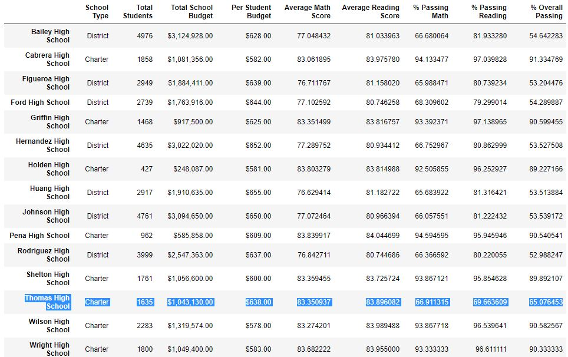
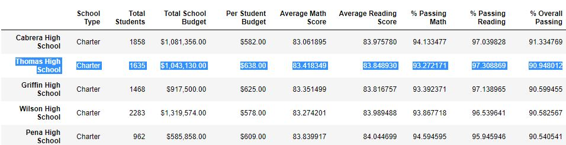
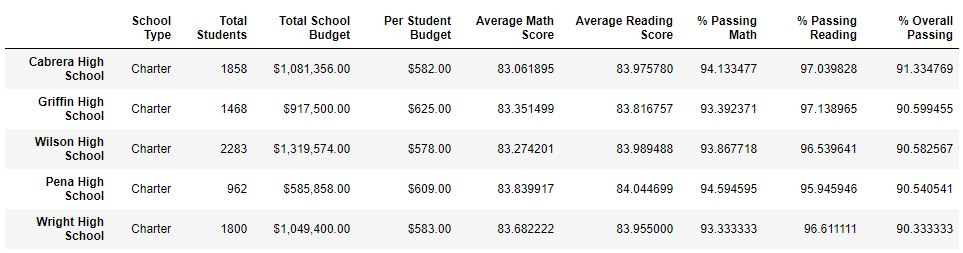
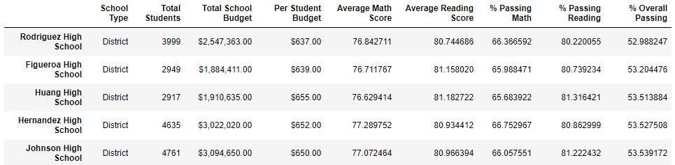
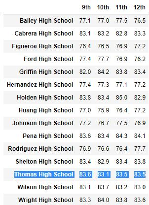
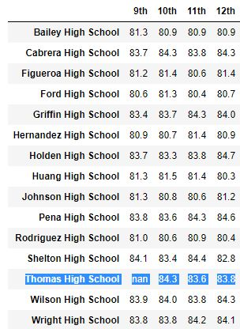
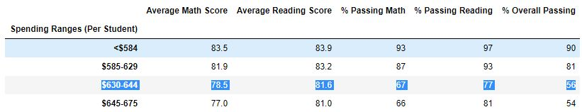
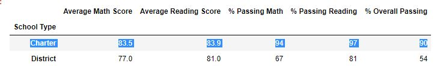

# Module 4 Challenge - PyCitySchools
The grades of the ninth graders at Thomas High School have been changed. While administrators do not know the full extent of this academic dishonesty, they want to uphold the standards of state testing and have turned to you for help.

After assessing the situation with the school superintendent and Maria, it was decided that the best approach is to:

- Replace the ninth-grade math and reading scores from Thomas High School.
- Keep all other data associated with the ninth-grade students and Thomas High School intact.

## Challenge Overview

- Filter DataFrames using logical operators.
- Replace the incorrect values with NaN.
- Explain how your PyCitySchools analysis changes after you handle the incorrect data.

## Resources
Data Source: schools_complete.csv, clean_students_complete.csv, students_complete.csv, Cleaning_ThomasHS_9thGrade_results.ipynb

Software: Python 3.7.6 with Pandas & Numpy, Anaconda, Jupyter Notebook

## Challenge Summary
### How is the district summary affected?

The average math score, % passing math, % passing reading and % overall passing all decreased within a percentage point as a result of replacing Thomas High School's 9th grade results.

*please refer to appendix 1

### How is the school summary affected?

While the average math score decreased within a percentage point, the average reading score increased within a percentage point, however % passing math, % passing reading, and % overall passing decreased drastically with each losing approximately 25-30 percentage points.

*please refer to appendix 2

### How does removing the ninth graders’ math and reading scores affect Thomas High School’s performance, relative to the other schools?

Thomas High School was initially within the top 5 performing schools (ranked #2), but since removing the 9th grade student grades, is no longer within the top 5 performing schools. There was no evidence of change amongst the bottom 5 performing schools.

*please refer to appendix 3 & 4

### How does removing the ninth grade scores affect the following:

Math and Reading Scores by Grade

Thomas High School now shows "nan" under 9th grade scores for both Math and Reading

*please refer to appendix 5 & 6

### Scores by School Spending

Spending ranges per student between $630-644 were negatively affected, showing decreases within % passing math, % passing reading, and % overall passing by approximately 7 percentage points.

*please refer to appendix 7

### Scores by School Size

Medium school size (1000-2000 students) were negatively affected, showing decreases within % passing math, % passing reading, and % overall passing by approximately 6 percentage points.

*please refer to appendix 8

### Scores by School Type

Charter school types were negatively affected, showing decreases within % passing math, % passing reading, and % overall passing by approximately 4 percentage points.

*please refer to appendix 9

### 1. District School Summary - PRE 

### 1. District School Summary - POST

### 2. School Summary - PRE

### 2. School Summary - POST

### 3. Top 5 Performing Schools - PRE

### 3. Top 5 Performing Schools - POST

### 4. Bottom 5 Performing Schools - PRE

### 4. Bottom 5 Performing Schools - POST

### 5. Math Scores by Grade - PRE

### 5. Math Scores by Grade - POST

### 6. Reading Scores by Grade - PRE

### 6. Reading Scores by Grade - POST

### 7. Scores by School Spending - PRE

### 7. Scores by School Spending - POST

### 8. Scores by School Size - PRE

### 8. Scores by School Size - POST

### 9. Scores by School Tyoe - PRE

### 9. Scores by School Tyoe - POST

